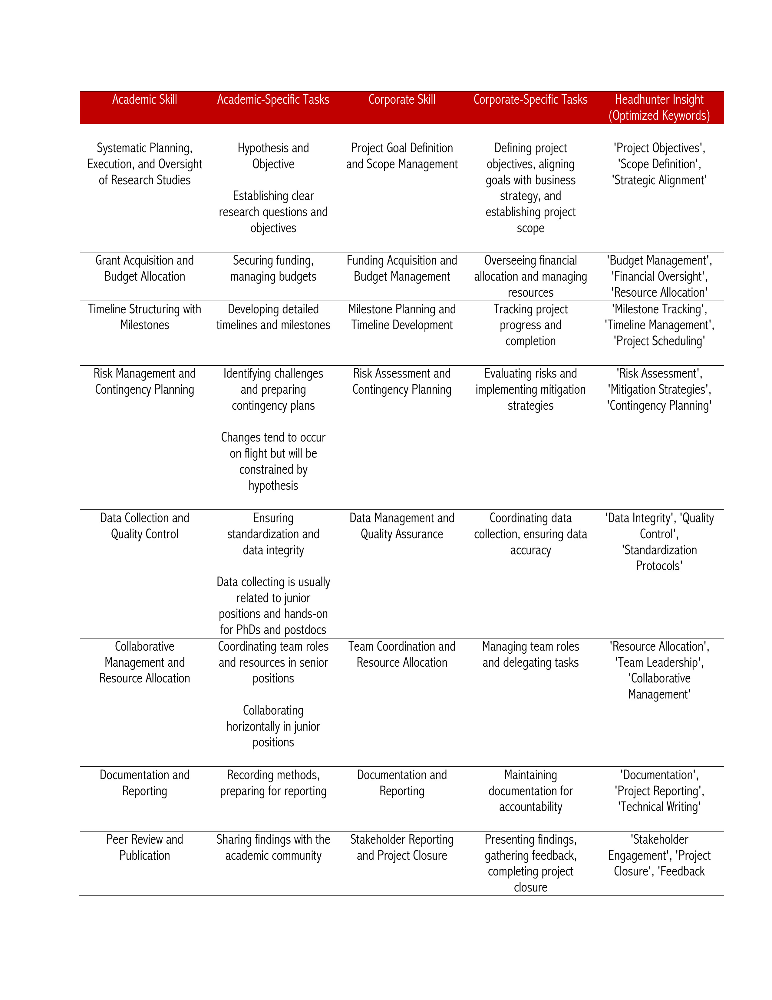

# Translating Academic Project Management into Corporate 

My academic background is in biology, and my professional experience is in healthcare, so this guide is particularly relevant for those with similar backgrounds. This is a personal, non-comprehensive effort to support those transitioning from strictly academic roles into corporate or industry environments.

## Academia is a Resource-Limited & Hands-On Environment 

In academia, project management skills are shaped primarily by limited resources and project scale. Large projects with constrained budgets, often seen in resource-limited countries, require researchers to adopt a hands-on approach and exercise considerable autonomy. In such cases, academic project managers (aka researchers) benefit from involvement in multiple stages, from conception to closing. These settings foster resourcefulness and resilience, as researchers frequently must manage complex tasks with minimal support.

## A place for Methodological Rigor with some Flexibility

In academia, **project management** is characterized by a structured yet adaptable approach that prioritizes scientific rigor and is constrained by **adherence to the research objectives**. Unlike corporate environments that often employ frameworks like Lean, Six Sigma, or Agile, academia typically follows a **Waterfall-like approach**: a linear, phase-based progression where each stage—hypothesis formulation, study design, data collection, analysis, and publication—builds upon the previous one to uphold methodological consistency. This structure ensures the research remains aligned with the original hypothesis, a core academic principle. Adaptations and pivots are carefully managed. Then, adjustments aren’t data-driven in the corporate sense but are instead guided by theoretical or experimental needs that support or test the hypothesis. In contrast, corporate changes may be based on immediate outcomes or efficiency goals.

## Planning and Resource Allocation has a Focus on Reliability Over Efficiency

Academic project management includes thorough risk planning and resource optimization due to strict funding and resource limitations. Efficiency is valued, but it takes a backseat to hypothesis adherence, with every phase designed to produce reliable, reproducible results rather than optimize solely for speed or cost.

## Takeaway for researchers transitioning from academia to corporate

For academics moving into corporate roles, describing their experience as a **hybrid of Waterfall with structured flexibility** conveys their strength in both structured project planning and objective-aligned adaptations. This perspective highlights that while academics are skilled in managing project timelines and resources, their flexibility is always bound by core scientific values. This distinction underlines their dedication to methodological integrity and goal-focused results.

Here, you can find some core skills of Project Management that I freely translated into corporate jargon.

## PM tools

In academia, project management tools are selected for their accessibility, support for **open science**, and collaborative features without high licensing costs. This contrasts with corporate environments, where tools are often chosen for their advanced functionality, integration capabilities, and ability to handle complex workflows across large teams. Academic settings prioritize tools that support easy sharing, transparency, and cost-effectiveness, such as open-source and free tools that facilitate collaboration across institutions. Corporate environments, however, tend to invest in scalable, feature-rich software with robust support and customization options, meeting the demands of structured project tracking, resource management, and compliance. GitHub is used for code collaboration and version control, which is crucial for reproducibility in research.

I asked ChatGPT to list the **top ten tools used for academic project management** using two main criteria (open source or free tools). Here is the list:

1.	GitHub (version control, code collaboration, documentation)
2.	Google Workspace (Docs, Sheets, Drive for collaboration)
3.	Trello (task management)
4.	Notion (knowledge management and project organization)
5.	Overleaf (collaborative writing, especially LaTeX documents)
6.	Slack (communication, free plan)
7.	Asana (project management, limited free plan)
8.	Microsoft Teams (communication and project collaboration)
9.	OpenProject (open-source project management)
10.	Taiga (open-source project management)

I have never used Notion, OpenProject, or Taiga from this list. My top two options are **GitHub and Google Workspace**.

Then, I asked the **top ten project management tools** commonly used in **corporate environments**: 

1.	Microsoft Project – Advanced project planning and scheduling
2.	JIRA – Project and issue tracking, famous for Agile
3.	Asana – Task tracking and team collaboration
4.	Trello – Visual, Kanban-style task management
5.	Monday.com – Customizable workflows for teams
6.	Smartsheet – Project management with a spreadsheet interface
7.	Basecamp – Project management with team communication
8.	Wrike – Gantt charts and time tracking
9.	ClickUp – All-in-one project management platform
10.	Notion – Flexible tool for notes and project management

**I hope this post can help you gain some valuable insights!**
