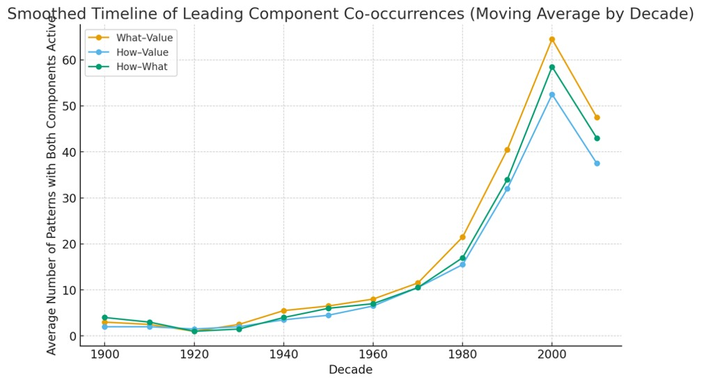
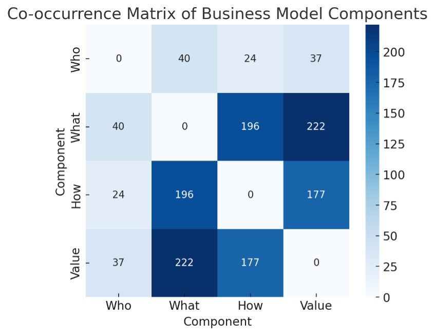

# **The missing dimension of innovation: why healthcare must start with “who”** 

> **and why the St. Gallen Business Model Navigator™ may not be the best benchmark for healthcare innovation**

An analysis of 55 canonical business-model patterns reveals a hidden truth: for 100 years, companies reinvented what they offer, how they deliver, and how they make money—while rarely redefining who they serve. Personalized healthcare breaks that rule.

## **TL;DR**
Most business-model innovation lives in the triangle of what, how, and value. The “who” (customer) stays stable. That’s precisely why personalized healthcare is hard: it asks us to innovate where industries historically refused to go.

## **Intro**
We like to believe every major wave of innovation changes everything. The data suggests otherwise. When you examine the well-known 55 business-model patterns proposed by Gassmann, Frankenberger, and Csik (2013)—the ones leaders replicate in case studies and playbooks—you see a striking asymmetry.
For more than a century, innovation has focused on changing the offering (what), the delivery system (how), and monetization (value). Meanwhile, the target customer—“who”—has barely changed. Healthcare’s shift toward personalization means the sector is about to innovate in the one area almost no one has touched for 100 years. We are moving from segments to singulars. That is the real business model shift.

## **What the evidence shows**
I mapped the 55 patterns onto four dimensions (who, what, how, value) and expanded the examples by year. Then I asked two questions: which dimensions actually move together, and do all four contribute equally? I first charted pairwise couplings to reveal the backbone of co-evolution, then checked triads and the rare four-way cases. The result holds: the innovation engine is the what–how–value triangle. In practice, new offers come with new pricing; new processes enable new offers; and new monetization follows new delivery. “Who” rarely joins this core. Full four-dimension shifts are exceptional.

**Limitations matter.** This analysis uses the 55 patterns (a curated subset of 250 cases the authors examined). Inclusion criteria are not fully specified, so sample bias is intrinsic. The Navigator focused on industries with visible commercial reinvention; regulated, slow-moving sectors like healthcare are largely absent to keep the patterns transferable. Even so, the findings align with the historical record of innovation. Let’s look.

## **The logic of the innovation timeline (1900–2020)**
 

Figure 1. Timeline of patterns with both components active. “Who” couplings are omitted due to persistently weak pairing in the dataset.

**Before 1950:** low and balanced activity; innovation mainly incremental.

**1950–1970:** steady climb; managerial and consumer revolutions synchronize how and what.

**1980–2000:** sharp acceleration; digitalization and platforms lift all three pairings, with what–value leading.

**Post-2010:** slight decline; maturity and optimization of existing digital models.

Across the century, the structural engine of business-model innovation remains the same: the co-evolution of what, how, and value. “Who” (customer/payer identity) changes only episodically.

Figure 2. Co-occurrence matrix of components. The pale periphery of “who” indicates weak participation relative to what, how, and value.

Across all 55 business-model patterns and their exemplary companies: the strongest co-occurrences are **what–value (222)**, **what–how (196)**, and **how–value (177)**. Together, these form the tripod that dominates the network. “Who” has far fewer links (e.g., 24 with “how,” 40 with “what”). 

## **Healthcare is now betting on personalization**
This means the sector is about to innovate in the one place almost no one has touched for 100 years. Companies rarely change the target customer at the same time they change the offer, operations, or pricing. In practice, they keep serving the same audiences while optimizing everything around them.

## **What this means outside academia**
This dataset is curated, not a census. But it captures the playbook managers and entrepreneurs actually use. It’s a mirror of industrial imagination. And in that mirror, the “who” is sacred: don’t touch the customer; change everything around them.

## **From segmentation to singularization**
Traditional innovation assumes segments, the untoucheable chair leg. Personalized healthcare assumes singulars.
In a segmented world, “who” is fixed. You optimize what, how, and value around a known audience and a stable payer. In a personalized world, “who” becomes dynamic. The customer is co-defined by biology, context, and data in real time. Patients are not just value recipients; they are data sources and, at times, co-producers. Crucially, the definition of value shifts with their profile.
> **That is not a marketing tweak. It is a structural inversion of the business model.**

## **Why industries avoided touching the “who” dimension**
Customer identity is sticky, but it is also the hidden leg of the chair. That one we don't see in my sketch but we know it is pivotal.  Distribution, brand, compliance, and partnerships are built around known customers. Switching “who” forces costly rewiring across the system.
Risk–reward is asymmetric. You can experiment with features or pricing cheaply; changing the customer threatens cash flows and stretches sales cycles.
Digital changed interfaces, not identities. The internet revolutionized access and monetization; it did not create fundamentally new paying actors. Instead, it encoded known customers as data profiles, stabilizing them further.

## **Healthcare now crosses that line**
>**Personalization in healthcare makes “who” a design variable, not a background assumption, the hidden leg.**

“Who” can be a different payer (employer, insurer, foundation), a different orchestrator (patient organization, registry, data trust), or a different decision agent (departmental buyer, workflow bot, compliance gateway). Most importantly, “who” can be an individual patient whose definition—and thus value—changes as new evidence arrives.
This is why the revolution is more complex than expected. We aren’t just adding genomics to old pathways. 

> **We are moving the only piece that the last century left untouched.**

## **Why this matters for startups**
The last century avoided the very dimension a startup must solve first. 
> **Personalized healthcare flips the logic to who–proof–pay. Seat the customer while designing the leg.**

In practice, startup discipline already aligns with the new triangle: choose a precise “who,” generate the smallest decisive proof for that who, and let pay follow. Startups are the natural carriers of the who–proof–pay revolution because they cannot afford the century-old habit of avoiding “who.”
