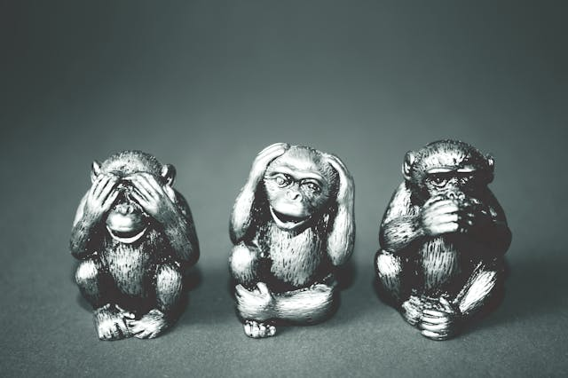

# WHY DO SCIENTISTS NOT BELIEVE IN SCIENCE, OR AT LEAST SHOULDN'T?

 

> *“...faith is not enough for many people. They long for solid evidence and scientific proof. They desire the 
> scientific seal of approval but do not want to submit to the rigorous standards of evidence that confer
> credibility to that seal. What a relief it would be: doubt reliably abolished!”
> – Carl Sagan, 1996.*

 
Science is not an absolute and irrefutable truth. The incontestable certitude belongs to the realm of religions and gods. Falsifiability is the cornerstone of science, distinguishing science from religion and allowing us to consider them two separate domains of human pursuits. Having faith in science is contradictory because its most remarkable attribute is doubt. Skepticism requires criticism grounded on robust arguments connected to theories. This means that opinions, impressions, pseudoscience, and especially fake news do not refute science. Only good science refutes science.

## Paradigms and Theories: The Flexibility of Scientific Knowledge

To start, let's try to understand what a theory is. There is a good chance that "theory" means "guess" (speculation, conjecture) for you. This is not the type of theory I’m talking about here, but Commonsense. Scientific theories are temporary truths that can be modified — they are not mere guesses. We advance our understanding and achieve practical applications by relying on a theory with numerous layers of knowledge. A theory is supported by paradigms that guide us, but they can be altered as new information becomes available. While paradigms are models open to criticism, dogmas are not. **Science deals with paradigms, while religions deal with dogmas**.

Strong paradigms persist over time, evolving and strengthening through minor adjustments ("cosmetic surgeries"), forming intricate theories that grow more robust and resilient. We do not want completely opposing paradigms. Instead, we remain open to slight adjustments to prevent major contradictions that would undermine the theory. In other words, we do not await a radical shift; we incorporate small changes when they are adequately proven, thus improving our paradigms.

This approach is akin to the methods used by civil engineering for constructing large structures. Gigantic concrete structures are intentionally designed to be more flexible than commonly perceived, thanks to advanced materials and engineering calculations. Consider the example of buildings in earthquake-prone areas or long bridges built over the sea. These constructions must accommodate minor structural changes to withstand massive natural challenges. In short, **“Weebles wobble, but they don't fall down!."** A typical cyclone does not bring down a bridge at sea, just as internet gossip does not topple scientific theories.

 
Theory is defined slightly differently in mathematics, the mother of all sciences. There, theories are considered truths supported by tested theorems, proven within a restricted universe of possibilities. Thus, mathematical theory is an end in itself, not open to interpretation, unlike other sciences that rely on statistical probability to validate their hypotheses.

Defining what a scientific theory is — like defining methodology — mobilizes efforts from fields within the History and Philosophy of Science. Any quick definition of the word "theory" in science is shallow. Don’t worry, I’ll give you mine anyway. A scientific theory is an evidence-based framework shaped by paradigms with high predictive value derived from the scientific method. It comprises a series of hypotheses that have been exhaustively and rigorously tested, either directly or indirectly. It is subject to criticism and fallibility, so we use statistical methods to test its components and peer review process.

In biology, for example, compared to mathematics, we can hardly isolate our object of study so precisely, given the complexity of living beings and their biological events. Even if this object is meticulously isolated, it will still be affected by distant, uncontrollable variables. In simpler terms, a result obtained in a precisely controlled environment may act differently in the real world, where numerous other variables are present. The Grail of Science is obtaining highly generalizable results in isolation, making the theory powerfully predictive. Still, never perfect.

## Fallibility is not a problem at all
Don't let the fallibility of science leave a negative impression on you. Despite this, we have been capable of incredible scientific acts promoting significant disease prevention, treatment, and cure advances. Among them is the isolation of DNA and its related counterparts, which laid the foundation for several areas of study with "-omics" in their names, such as genomics, the study of genes and gene therapies, or proteomics, which is dedicated explicitly to proteins. It has also boosted research in pharmacology and healthcare, promoting undeniably relevant interventions, such as the creation of vaccines or advances in treatments to combat various types of cancer.

## Elaborated answers is a need
While reductionism can be helpful, it fails to capture the full complexity of an event. This partially explains why caution is the motto of scientists. We avoid giving definitive and univocal answers in complex situations, but some circumstances may force us to. The answer depends on the time we have, the depth we can reach, and our audience. Generally, constructing a reasonable answer can take a semester of graduate school, but we rarely have that much time available.

We had a respected professor for our Evolution Course at the Biological Sciences graduation. At that point in the course, it was clear that the statement "man came from monkeys," often repeated by laypeople about evolution, was utterly incorrect. However, by provoking our professor in various ways, we suggested humorous situations where we imagined he would have to respond effectively to a layperson's question: "So, did man come from monkeys?" In such a scenario, he wouldn't have the luxury of a semester's course in evolution to explain, nor would he even have a lecture to delve into explanations such as “It depends on which monkey you're talking about.”

It was a tricky situation. Now, imagine a scenario where he would answer "no." The person might spread the word that a respected evolution professor claimed humans have no evolutionary connection with modern monkeys. The simple and brief "yes" scenario is not that good either. It might risk our dignity as biologists. But still, we would embrace it, hoping to provide further clarifications. Faced with the choice of either making such a statement or throwing evolution in the trash, we concluded that a good answer would be: "Humans descend from extinct monkeys and from men who looked like monkeys (also extinct); in other words, today's monkeys are our very distant cousins." This way, we wouldn't tarnish our dear contemporary primates and their respectable millions of years of evolution.

 
The evolution of species is an example of a robust scientific theory. This means it encompasses an ocean of interconnected information from various fields of study, such as geology, paleontology, and biology. In this ocean, Ph.D. theses are mere tiny shells of knowledge. This is why in science, Ph.D. holders are often reticent and sound unsure to laypeople. Frequent expressions in our vocabulary are: "it depends on," "maybe," "usually," "probably," and all their synonyms. The more we acquire knowledge, the more we realize that we contribute only a tiny piece to the puzzle of an unknown landscape.

We are responsible for being community speakers, as science is inherently collaborative. Except for mathematics, all other scientific areas are known to be fallible.

The driving force of science is doubt, not belief.
